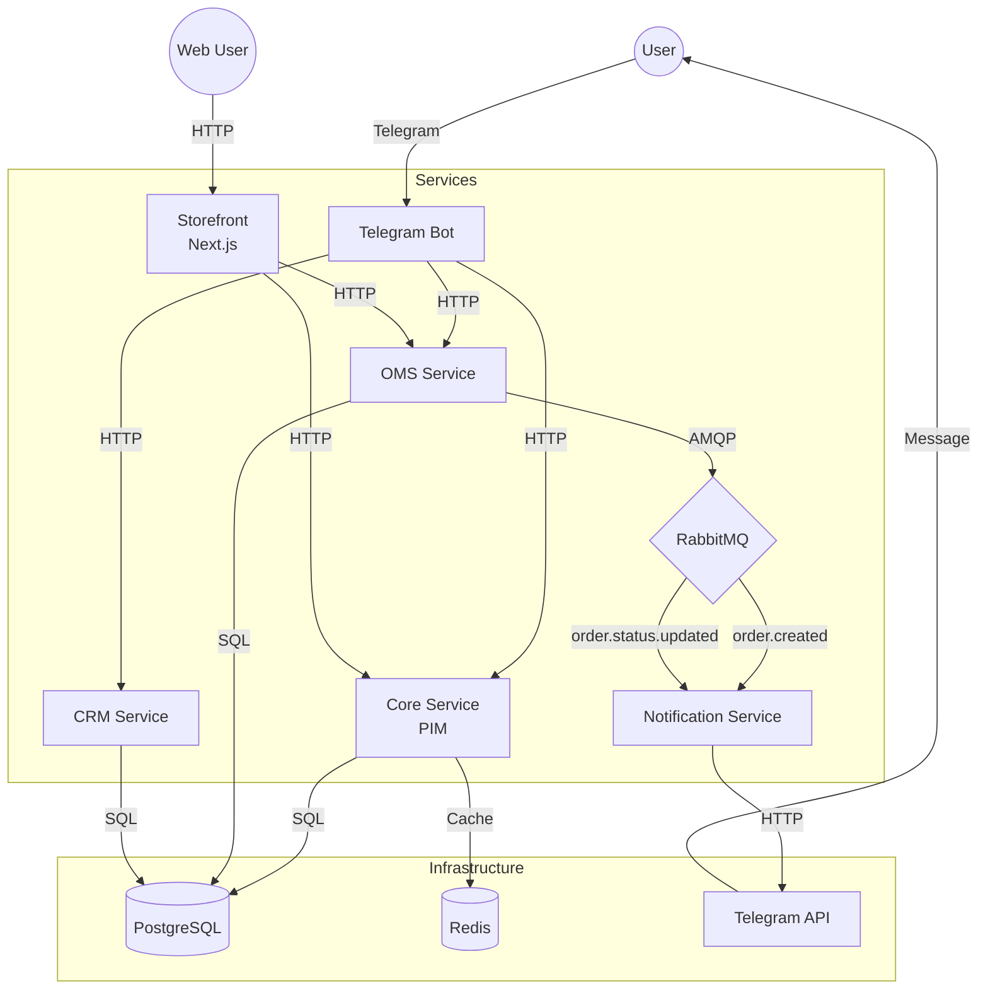

# Architecture

## System Overview



## Services

| Service | Port | Description |
|---------|------|-------------|
| **Core** | 8080 | Product Information Management (PIM) - товари, категорії, залишки, кошик, wishlist, історія цін |
| **OMS** | 8081 | Order Management System - замовлення, статуси, промокоди, платежі (Mono), Nova Poshta |
| **CRM** | 8082 | Customer Relationship Management - клієнти |
| **Bot** | - | Telegram Bot - інтерфейс користувача |
| **Notification** | - | Event consumer - сповіщення про замовлення |
| **Storefront** | 3000 | Web UI (Next.js) - веб-інтерфейс магазину |

## Infrastructure

| Component | Description |
|-----------|-------------|
| **PostgreSQL** | Основна база даних для всіх сервісів |
| **Redis** | Кеш для товарів та категорій (TTL 2-5 хв) |
| **RabbitMQ** | Message broker для Event-Driven Architecture |
| **Elasticsearch** | Full-text пошук товарів з фільтрами та автодоповненням |
| **Jaeger** | Distributed tracing для моніторингу запитів |
| **Prometheus** | Збір метрик продуктивності |
| **Grafana** | Візуалізація метрик та дашборди |

## Data Flow

### Перегляд товарів
1. User → `/products` → Bot
2. Bot → `GET /products` → Core
3. Core → Products list → Bot
4. Bot → Formatted cards with buttons → User

### Оформлення замовлення (Checkout FSM)
1. User → "✅ Оформити" → Bot
2. Bot → "Введіть телефон" → User
3. User → Phone → Bot
4. Bot → "Введіть адресу" → User
5. User → Address → Bot
6. Bot → Order summary → User
7. User → "✅ Підтвердити" → Bot
8. Bot → `POST /orders` (with phone, address) → OMS
9. OMS → Save to PostgreSQL
10. OMS → Publish `order.created` → RabbitMQ
11. Notification → Consume event
12. Notification → Send confirmation → Telegram API → User

### Зміна статусу замовлення
1. Admin → `/orders` → Bot
2. Bot → `GET /orders` → OMS
3. Admin → Click "⏳ PROCESSING" → Bot
4. Bot → `PATCH /orders/{id}` → OMS
5. OMS → Update status in DB
6. OMS → Publish `order.status.updated` → RabbitMQ
7. Notification → Consume event
8. Notification → Send status update → Telegram API → User

## Bot Navigation

```
/start
   │
   ▼
┌─────────────────────────────┐
│      🏠 Головне меню        │
│  ┌─────────┬─────────────┐  │
│  │🛍 Товари│📁 Категорії │  │
│  ├─────────┼─────────────┤  │
│  │🛒 Кошик │📦 Замовлення│  │
│  ├─────────┴─────────────┤  │
│  │     ℹ️ Допомога       │  │
│  └───────────────────────┘  │
└─────────────────────────────┘
         │
    ┌────┴────┐
    ▼         ▼
┌────────┐ ┌──────────┐
│Товари  │ │Категорії │
│(5/стор)│ │          │
├────────┤ ├──────────┤
│◀️  ▶️  │ │📁 Cat 1  │
│🏠 Меню │ │📁 Cat 2  │
└────────┘ │🏠 Меню   │
    │      └──────────┘
    ▼
┌─────────────────┐
│  Картка товару  │
│  ┌───────────┐  │
│  │🛒 В кошик │  │
│  │💳 Купити  │  │
│  └───────────┘  │
└─────────────────┘
         │
         ▼
┌─────────────────┐
│    🛒 Кошик     │
│  • Товар 1 ×2   │
│  • Товар 2 ×1   │
│  ─────────────  │
│  Разом: 500 грн │
│  ┌───────────┐  │
│  │✅ Оформити│  │
│  │🗑 Очистити│  │
│  └───────────┘  │
└─────────────────┘
         │
         ▼
┌─────────────────┐
│  FSM Checkout   │
│  ─────────────  │
│  1. Телефон     │
│  2. Адреса      │
│  3. Підтвердити │
└─────────────────┘
```

## Database Schema

### Core Service
```sql
products (
    id UUID PRIMARY KEY,
    name TEXT,
    price DECIMAL,
    sku TEXT UNIQUE,
    stock INT,
    image_url TEXT,
    category_id UUID REFERENCES categories(id),
    created_at TIMESTAMP,
    updated_at TIMESTAMP
)

categories (
    id UUID PRIMARY KEY,
    name TEXT,
    created_at TIMESTAMP
)

cart_items (
    user_id BIGINT,
    product_id UUID,
    name TEXT,
    price DECIMAL,
    quantity INT,
    image_url TEXT,
    added_at TIMESTAMP,
    PRIMARY KEY (user_id, product_id)
)

wishlist_items (
    user_id BIGINT,
    product_id UUID,
    name TEXT,
    price DECIMAL,
    image_url TEXT,
    added_at TIMESTAMP,
    PRIMARY KEY (user_id, product_id)
)

price_history (
    id UUID PRIMARY KEY,
    product_id UUID,
    old_price DECIMAL,
    new_price DECIMAL,
    changed_at TIMESTAMP
)
```

### OMS Service
```sql
orders (
    id TEXT PRIMARY KEY,
    product_id TEXT,
    product_name TEXT,
    quantity INT,
    status TEXT,
    user_id BIGINT,
    phone TEXT,
    address TEXT,
    created_at TIMESTAMP
)
```

### CRM Service
```sql
customers (
    id UUID PRIMARY KEY,
    telegram_id BIGINT UNIQUE,
    first_name TEXT,
    last_name TEXT,
    created_at TIMESTAMP
)
```

## Event Bus (RabbitMQ)

### Queues
| Queue | Producer | Consumer | Description |
|-------|----------|----------|-------------|
| `order.created` | OMS | Notification | Нове замовлення |
| `order.status.updated` | OMS | Notification | Зміна статусу |

### Event Payloads
```json
// order.created / order.status.updated
{
  "id": "ORD-123",
  "product_id": "uuid",
  "product_name": "iPhone 15",
  "quantity": 1,
  "status": "NEW",
  "user_id": 123456789
}
```

## Caching Strategy (Redis)

Core Service використовує Redis для кешування з автоматичною інвалідацією.

### Cache Keys

| Key Pattern | TTL | Description |
|-------------|-----|-------------|
| `products:all` | 2 хв | Список всіх товарів |
| `product:{id}` | 5 хв | Окремий товар |
| `categories:all` | 2 хв | Список категорій |
| `category:{id}` | 5 хв | Окрема категорія |

### Cache Invalidation

Кеш автоматично інвалідується при:
- **Create/Update/Delete товару** → `products:all` + `product:{id}`
- **UpdateStock/UpdateImage** → `products:all` + `product:{id}`
- **Create/Delete категорії** → `categories:all` + `category:{id}`

### Graceful Degradation

Якщо Redis недоступний, система працює без кешу (fallback до PostgreSQL).

```go
// Приклад використання
if s.cache != nil {
    if err := s.cache.Get(ctx, key, &result); err == nil {
        return result, nil // Cache hit
    }
}
// Cache miss or no cache - query database
```

## Tech Stack

| Component | Technology |
|-----------|------------|
| Backend | Go 1.24 |
| Database | PostgreSQL 15 |
| Cache | Redis 7 |
| Search | Elasticsearch 8.11 |
| Tracing | OpenTelemetry + Jaeger |
| Metrics | Prometheus + Grafana |
| Message Queue | RabbitMQ 3 |
| Frontend | Next.js 14 |
| Bot Framework | telebot v3 |
| Containerization | Docker + Compose |

## Full-Text Search (Elasticsearch)

Core Service використовує Elasticsearch для повнотекстового пошуку товарів.

### Search Features

| Feature | Description |
|---------|-------------|
| **Full-text search** | Пошук по назві, опису, категорії |
| **Fuzzy matching** | Толерантність до помилок друку |
| **Filters** | Категорія, ціна, наявність |
| **Sorting** | За ціною, датою, релевантністю |
| **Pagination** | Посторінковий вивід результатів |
| **Autocomplete** | Підказки при введенні |

### Search API Endpoints

| Endpoint | Method | Description |
|----------|--------|-------------|
| `/search?q=...` | GET | Пошук товарів |
| `/search/suggest?q=...` | GET | Автодоповнення |
| `/search/reindex` | POST | Переіндексація |

### Index Settings

```json
{
  "settings": {
    "analysis": {
      "analyzer": {
        "product_analyzer": {
          "type": "custom",
          "tokenizer": "standard",
          "filter": ["lowercase", "asciifolding"]
        }
      }
    }
  }
}
```

## Distributed Tracing (OpenTelemetry)

Всі запити трейсяться через OpenTelemetry з експортом до Jaeger.

### Span Types

| Span Type | Description |
|-----------|-------------|
| **HTTP** | Вхідні HTTP запити |
| **Database** | SQL операції (PostgreSQL) |
| **Cache** | Redis операції |
| **Search** | Elasticsearch запити |
| **External** | Зовнішні сервіси |

### Trace Context Propagation

Контекст трейсу передається між сервісами через HTTP заголовки:
- `traceparent` (W3C Trace Context)
- `baggage`

### Environment Variables

| Variable | Default | Description |
|----------|---------|-------------|
| `OTEL_EXPORTER_OTLP_ENDPOINT` | - | OTLP endpoint (Jaeger) |
| `OTEL_SAMPLE_RATE` | 1.0 | Частота семплювання (0.0-1.0) |
| `ENVIRONMENT` | development | Назва середовища |

## Monitoring

### Prometheus Metrics

| Metric | Type | Description |
|--------|------|-------------|
| `http_requests_total` | Counter | Кількість HTTP запитів |
| `http_request_duration_seconds` | Histogram | Тривалість запитів |
| `http_requests_in_flight` | Gauge | Активні запити |

### Health Check Endpoints

| Endpoint | Description |
|----------|-------------|
| `/health` | Статус всіх компонентів (DB, Redis, ES) |
| `/health/live` | Liveness probe для Kubernetes |
| `/metrics` | Prometheus метрики |

### Grafana Dashboards

- **Service Overview** - загальна статистика сервісу
- **Request Latency** - час відповіді по ендпоінтах
- **Error Rate** - рівень помилок

## Reviews & Ratings

### API Endpoints

| Endpoint | Method | Description |
|----------|--------|-------------|
| `/reviews` | POST | Створити відгук |
| `/reviews/{id}` | GET/DELETE | Отримати/видалити відгук |
| `/products/{id}/reviews` | GET | Відгуки на товар |
| `/products/{id}/rating` | GET | Середній рейтинг |
| `/users/{id}/reviews` | GET | Відгуки користувача |

## Recommendations

### API Endpoints

| Endpoint | Description |
|----------|-------------|
| `/products/{id}/similar` | Схожі товари |
| `/products/{id}/frequently-bought-together` | Часто купують разом |
| `/recommendations/popular` | Популярні товари |
| `/users/{id}/recommendations` | Персональні рекомендації |

## Analytics

### API Endpoints

| Endpoint | Description |
|----------|-------------|
| `/analytics/dashboard` | Загальна панель |
| `/analytics/top-products` | Топ товарів за продажами |
| `/analytics/daily-sales` | Продажі по днях |
| `/analytics/by-category` | Продажі по категоріях |

## Inventory Alerts

### API Endpoints

| Endpoint | Description |
|----------|-------------|
| `/inventory/low-stock?threshold=10` | Товари з низьким запасом |
| `/inventory/out-of-stock` | Товари без запасу |
| `/inventory/stats` | Статистика складу |
