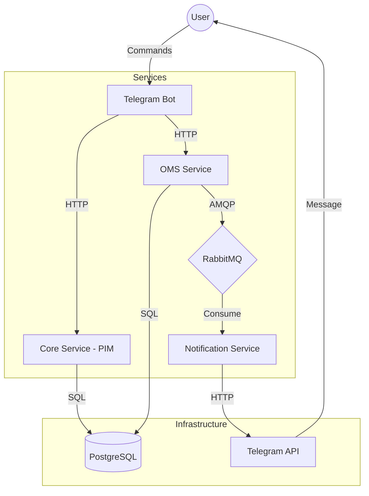

# Architecture

## Services

| Service | Port | Description |
|---------|------|-------------|
| **Core** | 8080 | Product Information Management (PIM) |
| **OMS** | 8081 | Order Management System |
| **Bot** | - | Telegram Bot interface |
| **Notification** | - | Event consumer for confirmations |

## Data Flow

1. User sends `/products` to Telegram Bot.
2. Bot fetches products from Core Service (HTTP).
3. User clicks "Buy" button.
4. Bot sends order to OMS (HTTP).
5. OMS saves order to PostgreSQL.
6. OMS publishes `order.created` event to RabbitMQ.
7. Notification Service consumes the event.
8. Notification Service sends confirmation via Telegram API.
